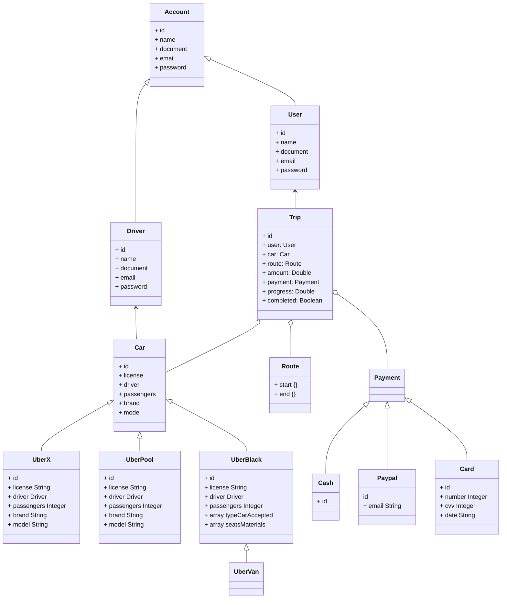

# OOP Uber Project UML

```mermaid
classDiagram
class Account {
    + id
    + name
    + document
    + email
    + password
}
Account <|-- User 
User: + id
User: + name
User: + document
User: + email
User: + password

Account <|-- Driver
Driver: + id
Driver: + name
Driver: + document
Driver: + email
Driver: + password 

class Car {
    + id
    + license 
    + driver 
    + passengers
    + brand
    + model
}
Car <|-- UberX
UberX: + id
UberX: + license String
UberX: + driver Driver
UberX: + passengers Integer
UberX: + brand String
UberX: + model String

Car <|-- UberPool
UberPool: + id
UberPool: + license String
UberPool: + driver Driver
UberPool: + passengers Integer
UberPool: + brand String
UberPool: + model String

Car <|-- UberBlack
UberBlack: + id
UberBlack: + license String
UberBlack: + driver Driver
UberBlack: + passengers Integer

UberBlack : + array typeCarAccepted
UberBlack : + array seatsMaterials

UberBlack <|-- UberVan

User <-- Trip
Driver <-- Car

class Trip{
    + id
    + user: User
    + car: Car
    + route: Route
    + amount: Double
    + payment: Payment
    + progress: Double
    + completed: Boolean
}

Trip o-- Route
Route: + start {}
Route: + end {}

Trip o-- Car
Trip o-- Payment

Payment <|-- Cash
Cash: + id

Payment <|-- Paypal
Paypal: id
Paypal: + email String

Payment <|-- Card
Card: + id
Card: + number Integer
Card: + cvv Integer
Card: + date String

```
